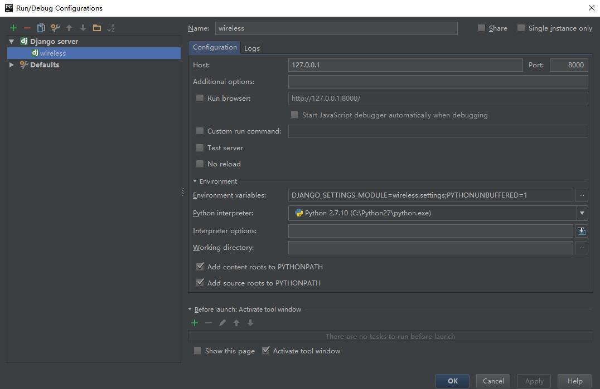

<!DOCTYPE html>
<html lang="en">
<head>
    <meta charset="UTF-8">
    <link rel="stylesheet" type="text/css" href="/static/CSS/bootstrap.min.css">
    <link rel="stylesheet" href="/static/CSS/bootstrap-theme.min.css">
    
    <title>配置文档</title>
</head>
<body>
    
这是为无线话务营帐系统写的一份简易配置文档.

    
使用此系统前需要配置的环境：

    <ul>
        1.Python 2.7
         
        2.MySQL 5.5及以上版本
         
        3.pycharm 2016.1及以上版本
    </ul>
     
    

        <li>
            部署文件：将wireless包解压缩至目标文件夹，打开pycharm，FILE—OPEN—目标文件夹（wireless）
             
             
        </li>
        <li>
            配置服务器信息：双击打开settings.py，至line78，DATABASES处修改数据库连接配置
             
            <pre>
                'NAME': 'managedb',// 数据库名，不可修改
                'USER': 'root',//数据库登录用户名，需获得数据库root权限
                'PASSWORD': 'creative',//所用用户密码
                'HOST': '127.0.0.1',//本机数据库不必修改
                'PORT': '3306'//数据库连接端口，默认为3306
            </pre>
        </li>
        <li>
            数据库表结构迁移：打开pycharm下方terminal（或者按ALT+F12），依次键入如下命令：
            <pre>
                python manage.py makemigrations
                python manage.py migrate
            </pre>
            如没有错误信息则说明数据库迁移成功，如果有错误信息请自行google或者百度233
             
             
        </li>
        <li>
            数据库数据导入：使用附带的wireless_data中sql文件导入，此处不再赘述
             
             
        </li>
        <li>
            进行服务器启动配置：打开pycharm工具栏 Run—Edit Configuration，按照下图配置即可
            
             
        </li>
        <li>
            启动服务器：单击右上角启动按钮，然后在浏览器中访问如下地址即可
            <pre>
                http://127.0.0.1:8000/
            </pre>
             
             
        </li>
    

</body>
</html>